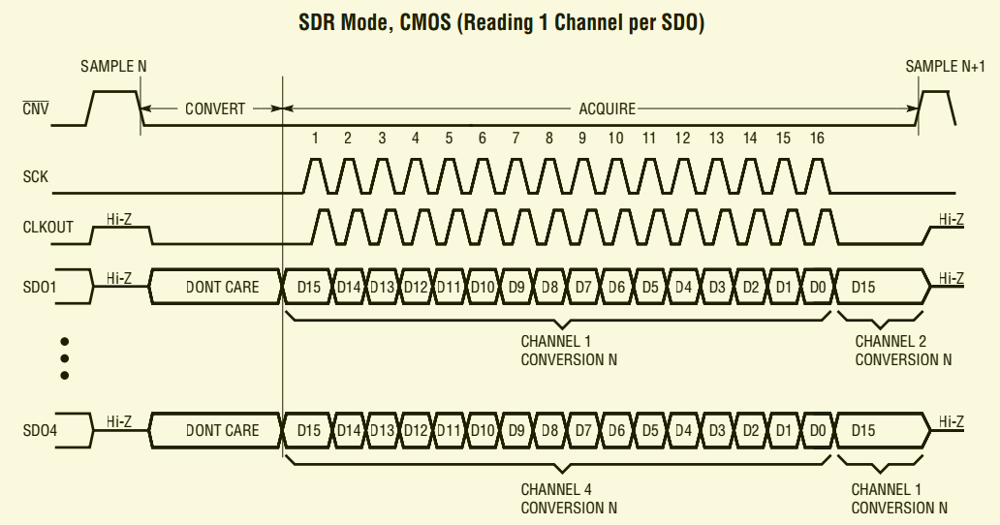
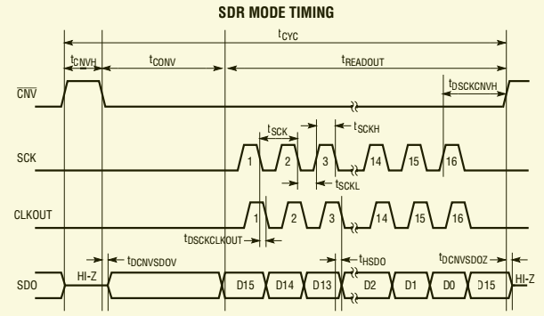

# DMA_AXIS_LTC2324_16

using SDR Mode, CMOS (Reading 1 Channel per SDO)

## LTC2324_16

* 2Msps/Ch Throughput Rate
* Four Simultaneously Sampling Channels
* Guaranteed 16-Bit, No Missing Codes
* 8VP-P Differential Inputs with Wide Input Common Mode Range
* 82dB SNR (Typ) at fIN = 500kHz
* –90dB THD (Typ) at fIN = 500kHz
* Guaranteed Operation to 125°C
* Single 3.3V or 5V Supply
* Low Drift (20ppm/°C Max) 2.048V or 4.096V Internal Reference
* 1.8V to 2.5V I/O Voltages
* CMOS or LVDS SPI-Compatible Serial I/O
* Power Dissipation 40mW/Ch (Typ)
* Small 52-Pin (7mm × 8mm) QFN Package

## TIMING DIAGRAM

* CNV  
  The rising edge jitter of CNV is
  much less critical to performance. The typical pulse width
  of the CNV signal is 30ns with < 1.5ns rise and fall times
  at a 2Msps conversion rate
* SCK  
  In DDR mode (SDR/DDR Pin 23 = OVDD),
  each input edge of SCK shifts the conversion result MSB
  first onto the SDO pins. A 55MHz external clock must be
  applied at the SCK pin to achieve 2Msps throughput using
  all four SDO1 through SDO4 outputs

## Links

* [LTC2324-16 Data Sheets](https://www.analog.com/media/en/technical-documentation/data-sheets/232416f.pdf)
